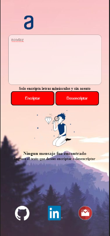
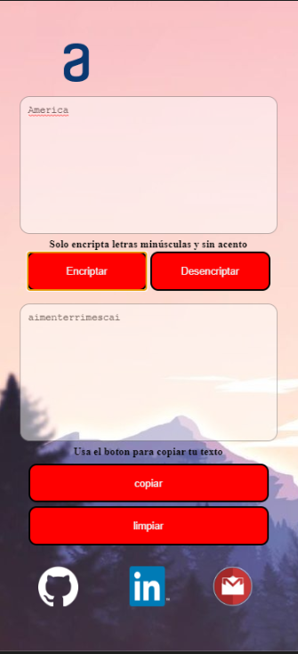

# ONE-Alura challenge Encryptor

## My first challenge --> "Encryptor"

An encrypter of words:

- The letter "e" is converted to "enter"
- The letter "i" is converted to "imes"
- The letter "a" is converted to "ai"
- The letter "o" is converted to "ober"
- The letter "u" is converted to "ufat"

## Content:

- Alura-Latam logo
- Container text
- Button Encryptor
- Button Decryptor
- Container Result
- Button Copy
- Button Clean
- Link to social networks

# **Desktop**

## Container empty

## Container with words and encrypter words

# **_iPad_**

## Container empty

## Words container and encrypter words

# **_Mobile_**

## Container empty

## Container with words and encrypter words

# Thank you for reading --> Follow me
